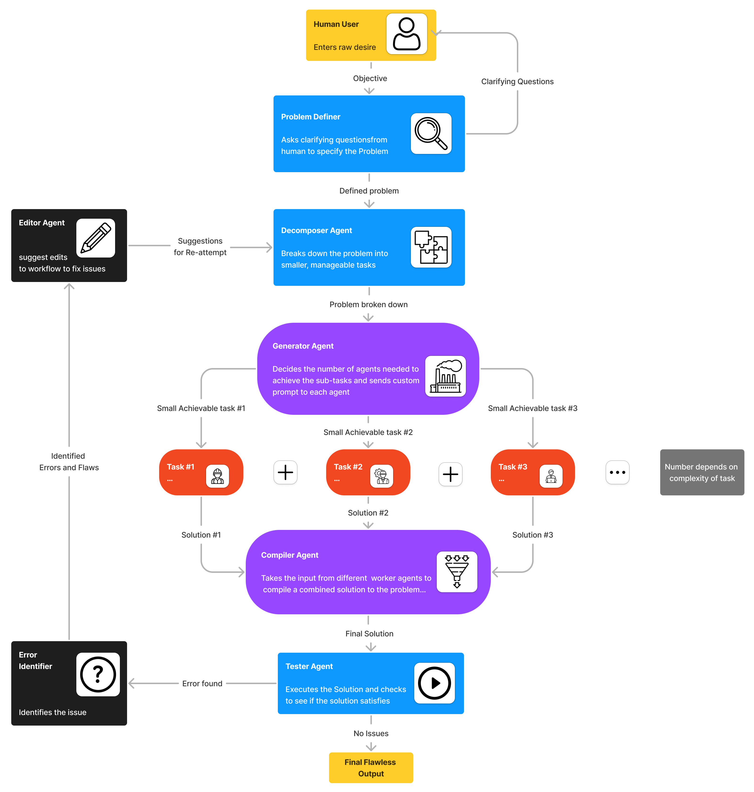

# Multi-Agent Framework for Efficient Problem Solving

The **Multi-Agent Framework for Problem Solving** is an advanced system that systematically addresses complex challenges by leveraging specialized agents. This architecture ensures a structured and collaborative approach, where each agent contributes to solving different aspects of the problem, resulting in comprehensive and effective solutions.

## Key Features

- **Modular Structure**: Composed of multiple specialized agents, each handling a specific task, enabling a divide-and-conquer strategy.
- **Iterative Refinement**: Agents collaborate iteratively, refining solutions until they meet the intended objectives.
- **Task Specialization**: Each agent excels in specific functions such as problem definition, decomposition, execution, testing, and revision.
- **Collaborative Coordination**: Seamless communication between agents facilitates improved problem-solving.

## System Workflow

### 1. Problem Definer Agent
- Engages with the user to clarify objectives through iterative questioning.
- Ensures a thorough understanding before passing the problem to the next stage.

### 2. Decomposer Agent
- Divides the problem into smaller, manageable subtasks.
- Explores alternative approaches for each subtask.

### 3. Generator Agent
- Determines the required number of Worker Agents.
- Assigns custom prompts for each task.

### 4. Worker Agents
- Specialize in executing assigned subtasks (e.g., coding, data analysis, modeling).
- Plan and document their reasoning in a structured manner.
- Iterate on solutions until a valid outcome is achieved.

### 5. Compiler Agent
- Integrates solutions from multiple Worker Agents into a coherent final result.
- Evaluates and selects the most effective combined solution.

### 6. Tester Agent
- Executes the final solution and assesses its alignment with the original problem.
- Provides feedback on strengths and areas for improvement.

### 7. Error Identifier Agent
- Analyzes the Tester's feedback to detect errors or inefficiencies.
- Categorizes and prioritizes issues based on their impact.

### 8. Editor Agent
- Suggests refinements based on identified issues.
- Iteratively improves the solution for enhanced effectiveness.

## Use Cases

This framework is applicable across diverse fields, including:

- **Software Development**: Automating code generation, debugging, and testing.
- **Data Analysis**: Extracting insights from complex datasets and generating reports.
- **Research & Development**: Conducting literature reviews and fostering innovation.
- **Business Strategy**: Analyzing market trends and offering strategic recommendations.

## License

This project is licensed under the **MIT License**. See the [LICENSE](LICENSE) file for more details.

## Future Enhancements

We are actively working on improving the framework with the following enhancements:

- Developing a user-friendly interface for better interaction and visualization.
- Optimizing inter-agent communication for improved efficiency and reduced latency.
- Expanding the range of specialized agents to support additional problem domains.
- Integrating machine learning to enable adaptive learning from past problem-solving experiences.

---

Contributions are welcome. Feel free to open an issue or submit a pull request.
